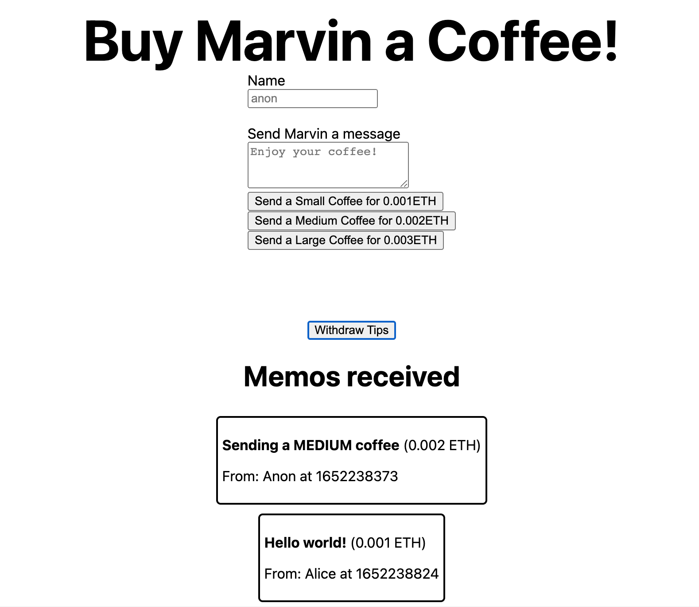

# 2. How to build "Buy Me a Coffee" DeFi Dapp (Solidity, Hardhat, Ethers.js, Alchemy)

## Screenshot


## Tutorial

Video: https://www.youtube.com/watch?v=cxxKdJk55Lk
```
0:00 - Intro
5:15 - Buy Me A Coffee project overview
8:17 - NPM setup
10:39 - Use Hardhat to start the project
15:35 - BuyMeACoffee.sol contract
28:10 - buy-coffee.js script
43:16 - MetaMask, Alchemy, Goerli Faucet
49:13 - Deploy to Goerli testnet
1:00:12 - Replit overview
1:03:37 - Fork my BuyMeACoffee Repl
1:05:12 - Customize your dapp
1:10:42 - Test your dapp
1:14:02 - Connect Wallet code
1:17:30 - Dapp code tour
1:20:50 - This week’s challenge
1:24:44 - withdraw.js script
```